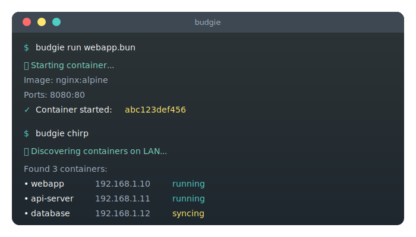

<p align="center">
  
</p>

<h1 align="center">Budgie</h1>

<p align="center">
  <strong>Simple, distributed container orchestration for your local network.</strong><br>
  Lightweight like its namesake, but handles discovery, replication, and load balancing without Kubernetes complexity.
</p>

<p align="center">
  <a href="https://github.com/zarigata/budgie/releases"></a>
  <a href="https://github.com/zarigata/budgie/blob/main/LICENSE"></a>
  <a href="https://github.com/zarigata/budgie/stargazers"></a>
  <a href="https://github.com/zarigata/budgie/issues"></a>
  <a href="https://goreportcard.com/report/github.com/zarigata/budgie"></a>
</p>

<p align="center">
  <a href="https://zarigata.github.io/budgie/">Website</a> •
  <a href="#-quick-start">Quick Start</a> •
  <a href="#-features">Features</a> •
  <a href="#-architecture-at-a-glance">Architecture</a> •
  <a href="#-documentation">Docs</a> •
  <a href="#-contributing">Contributing</a>
</p>

---

<p align="center">
  
</p>

## 🤔 Why Budgie?

Kubernetes power feels heavy on a local network. Budgie keeps it simple: a single binary that runs, discovers, replicates, and balances containers across your LAN with human-readable `.bun` files.

Perfect for:
- 🏠 **Home labs** and self-hosted setups
- 🔧 **Dev environments** spanning multiple machines
- 🏢 **Small team deployments** on local infra
- 📚 **Learning** distributed systems concepts

## ✨ Features

- 🔍 **LAN discovery** via mDNS — no manual IPs.
- 📦 **Readable `.bun` YAML** for images, ports, volumes, env, health checks, replicas.
- 🔄 **Volume sync** with rsync-style delta transfer and fsnotify watching.
- ⚖️ **Built-in reverse proxy** with round-robin & least-connections + health checks.
- 🐦 **Chirp** to list or join peers on the LAN.
- 🛠️ **Containerd-backed runtime** for reliable lifecycle management.

## 🚀 Quick Start

### Installation

**Linux / macOS:**
```bash
curl -fsSL https://raw.githubusercontent.com/zarigata/budgie/main/install.sh | sudo bash
```

**Windows (PowerShell as Admin):**
```powershell
irm https://raw.githubusercontent.com/zarigata/budgie/main/install.ps1 | iex
```

### Your First Container

1. **Create a `.bun` file:**

```yaml
# webapp.bun
version: "1.0"
name: "webapp"

image:
  docker_image: "nginx:alpine"

ports:
  - container_port: 80
    host_port: 8080
```

2. **Run it:**

```bash
budgie run webapp.bun
```

3. **Discover containers on your network:**

```bash
budgie chirp
```

4. **(Optional) Join a peer:**

```bash
budgie chirp <container-id>
```

> Need a full example? See [`example.bun`](example.bun).

## 🧭 Architecture at a glance

- **CLI** (`cmd/`): `run`, `ps`, `stop`, `chirp`, plus root command wiring.
- **Runtime** (`internal/runtime`): containerd wrapper for pull, create, start/stop, status.
- **Discovery** (`internal/discovery`): mDNS announce/discover with TXT metadata.
- **Sync** (`internal/sync`): rsync-style delta sync + fsnotify volume watching.
- **Proxy** (`internal/proxy`): HTTP reverse proxy with round-robin & least-connections.
- **Bundle** (`internal/bundle`): `.bun` parser and validation.
- **Types** (`pkg/types`): shared data structures.

## 🧰 Core commands

```bash
budgie run <file.bun>      # Start containers from a .bun spec
budgie ps                  # List running containers
budgie stop <id>           # Stop a container
budgie chirp               # Discover containers on your LAN
budgie chirp <id>          # Join a peer (for replication workflows)
```

## 📂 Data directory

- Default: `/var/lib/budgie/`
- Override: set `BUDGIE_DATA_DIR`

State persists container metadata and lifecycle info.

## 🛠️ Build & install

```bash
make build    # build binary
make install  # install to PATH
```

## 📖 Documentation

| Guide | Description |
|-------|-------------|
| [Quick Start](https://zarigata.github.io/budgie/getting-started/quick-start) | Get up and running in minutes |
| [Installation](https://zarigata.github.io/budgie/getting-started/installation) | Detailed installation instructions |
| [.bun File Format](https://zarigata.github.io/budgie/guides/bun-file-format) | Complete configuration reference |
| [Discovery & Replication](https://zarigata.github.io/budgie/guides/discovery-replication) | How containers find each other |
| [CLI Reference](https://zarigata.github.io/budgie/reference/cli-commands) | All available commands |

## 🤝 Contributing

Contributions are welcome! Please read our [Contributing Guide](CONTRIBUTING.md) for details on our code of conduct and the process for submitting pull requests.

## 📜 License

Budgie is open-source software licensed under the [MIT License](LICENSE).

---

<p align="center">
  <a href="https://github.com/zarigata/budgie">
    
  </a>
</p>

<p align="center">
  Built with ❤️ by the <a href="https://github.com/zarigata/budgie/graphs/contributors">Budgie community</a>
</p>